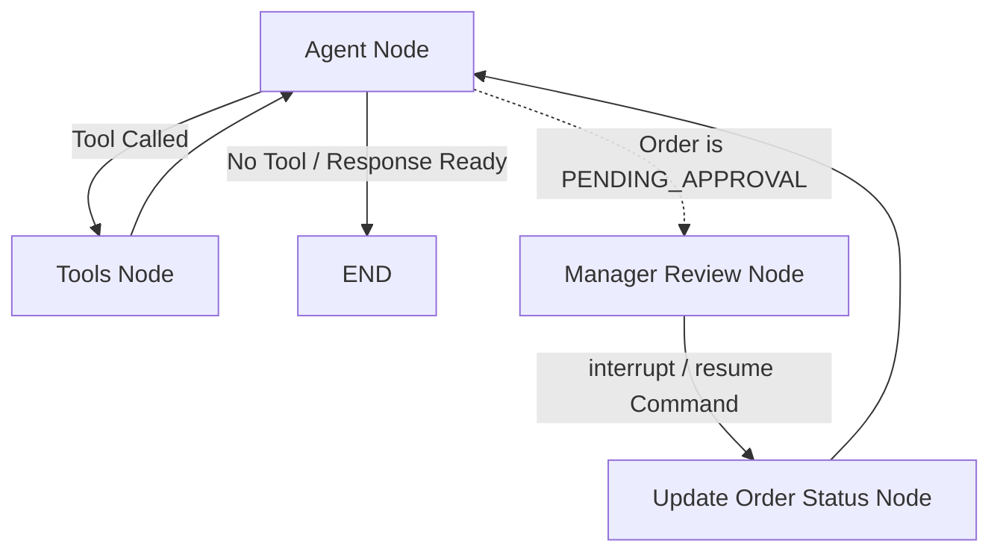

# Restaurant Ordering System with Human-in-the-Loop Approval

A state-of-the-art Restaurant Ordering System utilizing a multi-agentic state machine built with **Python**, **LangGraph**, **LangChain**, **Groq API (Llama 3.3 70B)**, **FastAPI**, and **SQLite**. The system showcases advanced Human-in-the-Loop (HITL) approval mechanics, automatic asynchronous background tasks, inventory synchronization, and modern glassmorphism web portals.

---

## 🚀 Key Features

*   **Multi-Agent State Graph**: Orchestrated via **LangGraph**, featuring an AI assistant node, tool execution node, manager review interrupt, and state synchronization.
*   **Groq LLM Engine**: Powered by `llama-3.3-70b-versatile` via **LangChain Groq**, providing rapid and highly accurate intent parsing and tool invocation.
*   **Dual Web Interfaces**:
    *   **Customer Portal** (`/`): A premium dark-themed glassmorphic chat interface to view the menu, converse with the AI agent, place/modify orders, and track order histories.
    *   **Manager Portal** (`/manager`): An approval dashboard where the manager reviews details of pending orders, submits approval or rejection decisions, and adds custom reviewer notes.
*   **Interactive CLI Interface** (`cli.py`): A full-featured terminal chat interface supporting inline manager interrupts and resumes.
*   **Asynchronous Cooking Pipeline**: A background worker thread is dispatched upon order approval. Exactly **60 seconds (1 minute)** after approval, the order status is automatically updated to `COOKED`.
*   **Robust Inventory Synchronization**:
    *   Quantities are verified in stock before draft order creation using the `check_order_feasibility` tool.
    *   Stock levels are deducted from the database automatically when an order is `APPROVED`.
    *   If an approved order is modified, the system automatically restores the stock of original items, resets the status to `DRAFT`, and prompts for re-approval.
    *   If an order is rejected, any held stock is restored to the menu inventory.

---

## 📐 System Architecture

The state graph is constructed using LangGraph:

1.  **Agent Node**: Interacts with the customer, reads system messages, and calls database tools.
2.  **Tools Node**: Executes tool calls requested by the agent (e.g. menu queries, order creation, modifications).
3.  **Manager Review Node**: Interrupted automatically using LangGraph's native `interrupt()` feature if an order transitions to `PENDING_APPROVAL`. It halts execution until resumed with a decision.
4.  **Update Order Status Node**: Applies the manager's decision (`APPROVED` or `REJECTED`) to the SQLite database and triggers the background cooking thread if approved.

### Workflow Routing Graph



---

## 📋 Order Lifecycle Statuses

Orders transition through the following states:

1.  **`DRAFT`**: Created when the customer specifies the items. No inventory is deducted yet.
2.  **`PENDING_APPROVAL`**: Triggered when the customer confirms they wish to submit the order. The LangGraph state pauses.
3.  **`APPROVED`**: Finalized by the manager. Items are automatically deducted from the inventory. Triggers a background thread that schedules cooking.
4.  **`COOKED`**: Automatically transitioned to this state exactly 60 seconds after entering `APPROVED` status.
5.  **`REJECTED`**: Finished by the manager. Any deducted/held inventory is restored back to the menu.
6.  **`DELIVERED`**: Optional final delivery stage.

---

## 🛠️ Database Schema

The SQLite database (`restaurant.db`) contains two primary tables:

*   **`menu`**: Stores active menu items (`name`, `price`, `available_qty`, `is_active`).
*   **`orders`**: Records order details (`customer_thread_id`, `items` (JSON), `status`, `manager_note`, `inventory_deducted`, timestamps).

---

## 🚀 How to Run

### 1. Install Dependencies

Ensure Python 3.11+ is installed. Clone the repository and install the required dependencies:

```bash
pip install -r requirement.txt
```

### 2. Configure Environment Variables

Create a `.env` file in the root directory (or update the existing one) with your Groq API Key:

```env
GROQ_API_KEY=gsk_your_groq_api_key_here
```

### 3. Running the FastAPI Web Application

To start the FastAPI backend server (which serves the Web UI portals):

```bash
python main.py
```
By default, the server runs on `http://127.0.0.1:8000`.

*   **Customer Portal**: Open [http://127.0.0.1:8000](http://127.0.0.1:8000) in your browser.
*   **Manager Portal**: Open [http://127.0.0.1:8000/manager](http://127.0.0.1:8000/manager) in your browser.
*   **API Documentation**: View interactive API docs at [http://127.0.0.1:8000/docs](http://127.0.0.1:8000/docs).

### 4. Running the CLI Client

If you prefer testing directly in your terminal:

```bash
python cli.py
```
This runs the chatbot loop. When your order reaches the approval stage, the system will prompt you inline to play the role of the manager and input your decision.

---

## 💬 Example Conversation Flow (CLI)

```text
Database initialized and seeded.

=============================================
      Welcome to the AI Restaurant!          
=============================================

--- MENU ---
- Burger: Rs. 120 (Stock: 20)
- Coke: Rs. 50 (Stock: 40)
- Coffee: Rs. 80 (Stock: 25)
- Fries: Rs. 90 (Stock: 30)
- Pizza: Rs. 250 (Stock: 15)
---------------------------------------------

You can chat with the assistant. Type 'exit' to quit.

Customer: I'd like to order 2 Burgers and a Coke.

Assistant: I have checked the availability and the items are in stock. I've created a DRAFT order for you (Order ID: 1) with 2 Burger(s) and 1 Coke(s). The total is Rs. 290. 

Please note that manager approval is mandatory to finalize all orders. Would you like me to submit this order for manager approval?

Customer: Yes, please.

=============================================
 SYSTEM INTERRUPT: MANAGER APPROVAL REQUIRED 
=============================================
Order ID: 1
Items:
  - Burger: 2
  - Coke: 1
Current status: PENDING_APPROVAL
=============================================
Manager, approve or reject this order? (a/r/exit): a
Manager note (optional): Approved! Get cooking.

Assistant: Great news! The manager has APPROVED your order (Order ID: 1) with the note: 'Approved! Get cooking.'. Your order is now being processed.

[System Notice] Order 1 is now COOKED! (1 minute has elapsed since approval)
```

