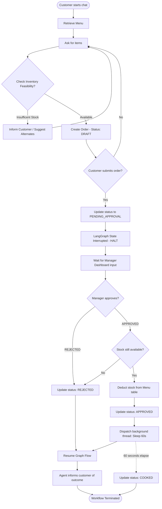
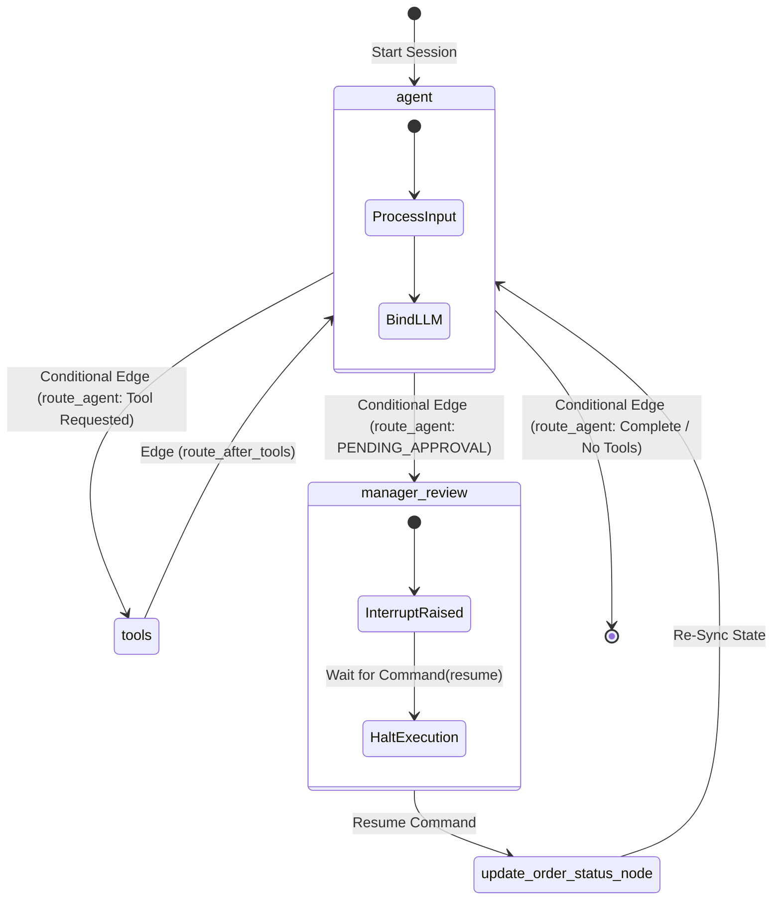
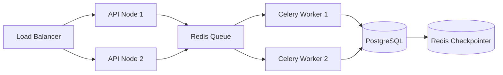

<h1 align="center">🍽️ Restaurant Ordering System with Human-in-the-Loop Approval</h1>

<p align="center">
  <strong>An enterprise-grade, multi-agentic state machine ordering platform.</strong>
</p>

<p align="center">
  
  
  
  
  
  
</p>

<p align="center">
  <em>A state-of-the-art implementation demonstrating native LangGraph checkpointers, stateful human-in-the-loop interrupts, background task runners, inventory reservation synchronization, and dynamic web portals.</em>
</p>

---

# Table of Contents

- [Project Overview](#project-overview)
- [Key Features](#key-features)
- [System Architecture](#system-architecture)
- [Complete Workflow](#complete-workflow)
- [File-to-Workflow Mapping](#file-to-workflow-mapping)
- [Architecture Decisions](#architecture-decisions)
- [Folder Structure](#folder-structure)
- [Database Design](#database-design)
- [State Machine](#state-machine)
- [Agent Workflow](#agent-workflow)
- [Tool Documentation](#tool-documentation)
- [File-by-File Code Walkthrough](#file-by-file-code-walkthrough)
- [API Documentation](#api-documentation)
- [Frontend Overview](#frontend-overview)
- [Backend Overview](#backend-overview)
- [Human-in-the-Loop Approval](#human-in-the-loop-approval)
- [Security](#security)
- [Scalability](#scalability)
- [Error Handling](#error-handling)
- [Technical Decisions](#technical-decisions)
- [Project Flow Summary](#project-flow-summary)
- [Screenshots & Demo](#screenshots--demo)
- [Installation](#installation)
- [Environment Variables](#environment-variables)
- [Future Improvements](#future-improvements)
- [Interview / Viva Questions](#interview--viva-questions)
- [License](#license)
- [Author](#author)

---

# Project Overview

Modern agentic workflows often struggle when executing transactions that require real-world checks, resource allocation, and managerial oversight. Simply letting an LLM write directly to a database can lead to catastrophic business errors: stock overallocation, incorrect pricing, or rogue order authorizations. 

This project solves this fundamental limitation by introducing a **Human-in-the-Loop (HITL) Agentic Ordering System**. By leveraging **LangGraph's state machine**, the system establishes a secure boundary where the AI agent acts as a conversational front-end that checks stock, calculates totals, and creates draft orders. However, the system strictly prevents the agent from finalizing transactions. Instead, the workflow is dynamically **interrupted** using native LangGraph checkpointers, forcing state serialization and transferring control to an external human manager via a dedicated dashboard. 

### Key Objectives
*   **Establish Hard Execution Boundaries**: The agent cannot commit inventory changes without manual approval.
*   **State Persistence & Recovery**: Conversations and order status survive app restarts, enabling async manager review days later.
*   **Prevent Double Reservation & Race Conditions**: Stock is reserved temporarily and verified sequentially before finalizing.
*   **Optimize Latency**: Heavy LLM calls are decoupled from background business operations like cooking pipelines.

---

# Key Features

*   **Stateful Conversational Memory**: Managed by LangGraph's `MemorySaver` checkpointer, tracking exact user history and intermediate draft states across unique thread IDs.
*   **Native Interrupts & Resumptions**: Uses LangGraph's `interrupt()` function to pause the active graph state during a manager review request. The graph resumes only when a structured `Command(resume=...)` is posted via the API.
*   **Transactional Inventory Guard**:
    *   **Feasibility Checks**: Validates stock quantities before a order is drafted using the `check_order_feasibility` tool.
    *   **State-Linked Deductions**: Automatically deducts menu inventory only upon entering the `APPROVED` state.
    *   **Automated Clean Reversion**: Reverting or modifying an approved order restores menu inventory, shifts order back to `DRAFT`, and prompts for re-approval.
*   **Decoupled Async Processing**: Simulates physical kitchen operations using daemon worker threads that transition order statuses to `COOKED` exactly **60 seconds (1 minute)** after manager approval.
*   **Dual-Portal Glassmorphism Web App**: A premium web interface built with modern CSS variables, serving a conversational Customer Chat interface alongside a real-time Manager Dashboard.
*   **Hybrid CLI client**: Includes `cli.py` for terminal testing, letting a developer converse and step through the manager approval process inline.

---

# System Architecture

The project is designed as a decoupled, three-tier architecture: the Client layer, the API Gateway/Service layer, and the Graph Execution Engine.

### Architectural Interaction Diagram

```mermaid
graph TB
    subgraph Client Layer (Web & CLI)
        CustUI["Customer Portal (static/index.html)"]
        MgrUI["Manager Portal (static/manager.html)"]
        CLI["CLI client (cli.py)"]
    end

    subgraph Service Layer (FastAPI Server)
        API["API Router (main.py)"]
        static["Static File Server"]
    end

    subgraph Agentic State Engine
        LGraph["LangGraph Compiler (graph.py)"]
        LLM["Llama-3.3-70b (via Groq API)"]
        Checkpointer["MemorySaver (State Storage)"]
    end

    subgraph Storage Layer
        DB[("SQLite Database (restaurant.db)")]
    end

    CustUI -->|POST /api/customer/chat| API
    MgrUI -->|GET /api/manager/pending-orders| API
    MgrUI -->|POST /api/manager/approve| API
    CLI -->|Invokes graph.stream()| LGraph
    
    API -->|graph.stream() / get_state()| LGraph
    LGraph -->|Binds Tools / Prompt| LLM
    LGraph -->|Read/Write State| Checkpointer
    LGraph -->|Calls Tools| DB
    API -->|Direct Queries / Updates| DB
```

### Component Flow Explanation
1.  **Client Requests**: The customer sends chat prompts. The browser forwards them to `/api/customer/chat`.
2.  **State Loading**: FastAPI routes the request to LangGraph. The engine looks up the `thread_id` and loads the conversation history and draft order from the `MemorySaver` checkpointer.
3.  **LLM Execution**: The prompt is augmented with `SYSTEM_PROMPT` containing guidelines (always pricing in Rupees, zero authorization powers). Groq evaluates the message and decides if tools are required.
4.  **Database Interaction**: If tools like `create_order` or `get_menu` are called, they execute queries against the `restaurant.db` SQLite database.
5.  **State Preservation**: After node execution, LangGraph saves the updated state. If a manager review is required, the state transitions to `manager_review`, where an `interrupt` is raised, halting thread execution.
6.  **Human Resolution**: The human manager interacts with the `/manager` page. Approving/rejecting issues a resume command back to the graph, which resumes from the point of interrupt, commits the DB updates, and returns a user-friendly response to the customer.

---

# Complete Workflow

The order workflow spans multiple clients and processes. The following diagram illustrates the complete execution path from a customer's initial inquiry to the order being cooked:



### Node-by-Node Explanation
*   **Start**: Conversation initialized on a distinct `thread_id` identifying the customer session.
*   **GetMenu**: Executed via the `get_menu` tool. It retrieves menu rows from the SQLite database.
*   **FeasibilityCheck**: Executed by the `check_order_feasibility` tool. Ensures the requested quantities are less than or equal to `available_qty` inside the menu table.
*   **DraftCreated**: Executed by the `create_order` tool. Creates a row in the `orders` table in `DRAFT` status. No stock is reserved or deducted at this stage.
*   **TransitionPending**: The customer instructs the agent to submit. The agent triggers the `update_order_status` tool, changing the order status to `PENDING_APPROVAL`.
*   **GraphInterrupt**: The state machine notices the transition. It invokes the `manager_review` node, raising a LangGraph `interrupt()`, which serializes the current call stack and variables, suspending graph execution.
*   **ManagerDecision**: The manager issues a HTTP POST to `/api/manager/approve` or `/api/manager/reject` with an optional review note.
*   **DeductStock**: Commits the transaction. Subtracts the item quantities from the `menu` table and marks `inventory_deducted = 1` inside the order record to prevent double-deductions.
*   **ScheduleCook**: Spawns a Python `threading.Thread` with a sleep delay of 60 seconds, decoupling cooking processing from the REST API request.
*   **CookOrder**: Updates status to `COOKED`.
*   **GraphResume**: The workflow restarts the agent node, enabling the LLM to output a natural confirmation of the decision to the customer.

---

# File-to-Workflow Mapping

| Workflow Step | Description | File | Function |
| :--- | :--- | :--- | :--- |
| **Database Setup** | Initializes menu table, order table, and seeds initial values. | [db.py](file:///d:/volume%20D/bootcamp/Restaurent-ordering-system/db.py) | `initialize_database()` |
| **Inventory Verification** | Inspects available menu stocks to ensure purchase viability. | [db.py](file:///d:/volume%20D/bootcamp/Restaurent-ordering-system/db.py) | `check_order_feasibility()` |
| **Draft Creation** | Inserts a new transaction record in `DRAFT` state. | [db.py](file:///d:/volume%20D/bootcamp/Restaurent-ordering-system/db.py) | `create_order()` |
| **Agent Prompt Binding**| Builds prompts, attaches system instructions, and evaluates user input. | [graph.py](file:///d:/volume%20D/bootcamp/Restaurent-ordering-system/graph.py) | `agent_node()` |
| **Routing Decision** | Evaluates message content to determine whether to call tools or end. | [graph.py](file:///d:/volume%20D/bootcamp/Restaurent-ordering-system/graph.py) | `route_agent()` |
| **Graph Halt** | Raises execution interrupt and serializes state context. | [graph.py](file:///d:/volume%20D/bootcamp/Restaurent-ordering-system/graph.py) | `manager_review_node()` |
| **State Resumption** | Receives manager input and resumes state machine flow. | [main.py](file:///d:/volume%20D/bootcamp/Restaurent-ordering-system/main.py) | `/api/manager/approve`, `/api/manager/reject` |
| **Status Commit** | Evaluates status logic, processes deductions/restorations. | [db.py](file:///d:/volume%20D/bootcamp/Restaurent-ordering-system/db.py) | `update_order_status()` |
| **Order Modification** | Re-adjusts quantities, restores original stock, and resets status to `DRAFT`. | [db.py](file:///d:/volume%20D/bootcamp/Restaurent-ordering-system/db.py) | `modify_order()` |
| **Cooking Pipeline** | Asynchronously transitions APPROVED orders to COOKED status. | [db.py](file:///d:/volume%20D/bootcamp/Restaurent-ordering-system/db.py) | `transition_to_cooked()` |

---

# Architecture Decisions

### Why FastAPI?
FastAPI was selected for its native support for asynchronous requests, high execution performance, automatic OpenAPI schema generation, and structural alignment with Python's asyncio model. This allows seamless coordination with LangGraph's streaming outputs and asynchronous web polling.

### Why LangGraph?
Unlike simple linear chains, customer ordering is highly cyclic. Customers change their minds, request items, ask questions, submit approvals, modify existing transactions, and cancel orders. LangGraph models the system as a **StateGraph**, allowing cycles (Agent ↔ Tools) and state control (Interrupt ↔ Resume) which are difficult to manage in standard LangChain execution structures.

### Why SQLite?
For local deployment and developer evaluation, SQLite provides a zero-configuration, serverless, single-file relational database. SQLite supports standard transactional mechanisms (ACID compliance), which are crucial for modifying stock quantities and processing inventory updates.

### Why MemorySaver Checkpointer?
LangGraph requires checkpointers to serialize the state graph at interrupt boundaries. `MemorySaver` offers an in-memory checkpointer that handles complex serialization of chat history and nested state variables without database configuration overhead.

### Why Human-in-the-Loop?
Large Language Models are prone to hallucination, prompting errors, and execution issues. For financial or transaction-based actions (like ordering food), forcing an explicit interrupt allows humans to act as a validation layer, verifying pricing, item selections, and inventory before committing to the transaction.

### Why REST API?
A RESTful API design decouples the user interface from the logic engine. The browser communicates with the server via HTTP endpoints, allowing the front-end to be replaced or upgraded independently.

### Why Vanilla HTML & Javascript instead of React?
To minimize compile times and build complexity, the frontend uses vanilla HTML5 and ES6 JavaScript. The client utilizes CSS transitions for glassmorphism styles and fetches data from backend APIs asynchronously without third-party frameworks.

### Why no Docker?
To simplify local setup, the program runs directly via standard Python command-line tools. However, a containerization model can be introduced by copying the files into a base Python image and exposing port `8000`.

---

# Folder Structure

Below is the directory tree of the workspace, showing the roles of the files in the architecture:

```text
Restaurant-ordering-system/
│
├── config.py              # Configuration manager, environment loading, LLM initialization
├── models.py              # Pydantic data schemas and LangGraph state representations
├── prompts.py             # System prompt containing behavioral parameters for the LLM
│
├── db.py                  # Database operations: schema creation, inventory handling, cooking loops
├── tools.py               # Functional tools exposed to the agent for database operations
├── graph.py               # StateGraph layout, routing edges, and compiled execution graph
│
├── main.py                # FastAPI server hosting REST API endpoints and static folders
├── cli.py                 # Interactive command-line interface for local debugging
├── app.py                 # Streamlit dashboard script for developer verification
│
├── restaurant.db          # SQLite active database file (generated automatically)
├── requirements.txt       # Dependency manager configuration
├── .env                   # Configuration file storing API keys and variables
│
└── static/                # Single Page Application static files
    ├── index.html         # Customer Ordering portal UI
    └── manager.html       # Manager approval portal dashboard
```

*   **`config.py`**: Reads `.env` configuration, initializes the Groq model `llama-3.3-70b-versatile`, and exports the LLM instance.
*   **`models.py`**: Defines structured schemas like `OrderItem` (Pydantic), `CurrentOrder` (order state metadata), and `AgentState` (the active LangGraph state dictionary).
*   **`db.py`**: Directly manages the SQLite backend database, handling ACID compliance for stock changes and spawning background threads for cooking orders.
*   **`tools.py`**: Encapsulates DB functions within `@tool` decorators, exposing menu checks, order edits, and status updates to the LLM agent.
*   **`graph.py`**: Combines nodes, routers, and checkpointers into a stateful workflow, compilation, and exports the compiled `graph`.
*   **`main.py`**: Implements the FastAPI server, hosting REST endpoints and serving the customer and manager portals.
*   **`static/index.html`**: Premium user interface containing interactive elements, styling, and fetch requests.
*   **`static/manager.html`**: A control dashboard using API polling to show pending orders and submit approvals.

---

# Database Design

The system uses a relational database schema designed to prevent stock race conditions and maintain status integrity.

### Entity-Relationship Diagram
```text
  +-----------------------------------+             +--------------------------------------+
  |                menu               |             |                orders                |
  +-----------------------------------+             +--------------------------------------+
  | item_id (PK) : INTEGER            |             | order_id (PK) : INTEGER              |
  | name (UNIQUE): TEXT               |             | customer_thread_id : TEXT            |
  | price        : REAL               |   1:N       | items (JSON string) : TEXT           |
  | available_qty: INTEGER            |-----------> | status : TEXT                        |
  | is_active    : INTEGER (default 1)|             | manager_note : TEXT                  |
  |                                   |             | inventory_deducted : INTEGER (0 / 1) |
  |                                   |             | created_at : TEXT                    |
  |                                   |             | updated_at : TEXT                    |
  +-----------------------------------+             +--------------------------------------+
```

### Table Schema Details

#### Table: `menu`
Stores the active menu items, pricing details, and stock levels.

| Column | Type | Constraints | Description |
| :--- | :--- | :--- | :--- |
| **`item_id`** | `INTEGER` | `PRIMARY KEY AUTOINCREMENT` | Unique identifier for each menu item. |
| **`name`** | `TEXT` | `UNIQUE NOT NULL` | Name of the food item (e.g., "Burger", "Pizza"). |
| **`price`** | `REAL` | `NOT NULL` | Price in Rupees (Rs.). |
| **`available_qty`** | `INTEGER` | `NOT NULL` | Current stock count. |
| **`is_active`** | `INTEGER` | `DEFAULT 1` | Soft delete flag (1 = Active, 0 = Inactive). |

#### Table: `orders`
Stores order records, customer threads, status histories, and inventory status flags.

| Column | Type | Constraints | Description |
| :--- | :--- | :--- | :--- |
| **`order_id`** | `INTEGER` | `PRIMARY KEY AUTOINCREMENT` | Unique identifier for each order. |
| **`customer_thread_id`** | `TEXT` | `NOT NULL` | LangGraph session thread tracking the customer. |
| **`items`** | `TEXT` | `NOT NULL` | JSON string array of items: `[{"item": "Burger", "qty": 2}]`. |
| **`status`** | `TEXT` | `NOT NULL` | Order status (e.g., `DRAFT`, `PENDING_APPROVAL`, `APPROVED`, `COOKED`, `REJECTED`). |
| **`manager_note`** | `TEXT` | `NULLABLE` | Review comments submitted by the manager. |
| **`inventory_deducted`** | `INTEGER` | `DEFAULT 0` | Bit flag indicating if inventory has been deducted (1 = Yes, 0 = No). |
| **`created_at`** | `TEXT` | `NULLABLE` | Timestamp of row creation (ISO 8601). |
| **`updated_at`** | `TEXT` | `NULLABLE` | Timestamp of the last row update (ISO 8601). |

### Structural Rationale
1.  **JSON Array Storage**: Storing order items as a JSON string inside the `orders` table keeps the schema simple, avoiding complex many-to-many lookup tables while allowing easy updates in a single database query.
2.  **Relational Database Engine**: Relational storage guarantees ACID compliance, ensuring that operations like deducting inventory or updating order status are handled reliably.
3.  **`inventory_deducted` Bit Flag**: Acts as a concurrency guard. By checking if `inventory_deducted` is `1` before altering stock levels, the database layer ensures inventory is never double-deducted or double-restored during state transitions.
4.  **NoSQL vs. Relational**: MongoDB was rejected because multi-table operations (checking stock, updating order status, and adjusting available inventory) require transactions. A SQL model is a better fit for transactional systems.

---

# State Machine

The compiled state machine orchestrates how the agent, tools, and manager approval nodes interact.



### State Variables & Transitions
*   **State Graph definition**: Initialized using `StateGraph(AgentState)` where `AgentState` contains conversation messages, current draft details, thread indicators, and tool outputs.
*   **Conditional Edges**:
    *   `route_agent`: Evaluates the last message from the LLM. If the LLM generates a tool call, execution routes to the `tools` node. If the order status changes to `PENDING_APPROVAL`, it routes to the `manager_review` node. Otherwise, it ends the execution loop (`__end__`).
    *   `route_after_tools`: Redirects execution back to the `agent` node, allowing the LLM to process tool outputs and formulate a response.
*   **Interrupt & Resume**: Halts graph execution using the `interrupt()` system function in the `manager_review` node. When the API calls `Command(resume=...)`, the graph resumes, sending the payload to `update_order_status_node` to commit status updates.

---

# Agent Workflow

The agent workflow manages inputs, node processes, and outputs.

```text
    +-------------------------------------------+
    | Input: User Message & thread_id           |
    +-------------------------------------------+
                          |
                          v
    +-------------------------------------------+
    | Node 1: agent_node                        |
    |  - Syncs state with SQLite                |
    |  - Generates prompt from SYSTEM_PROMPT    |
    |  - Invokes llama-3.3 LLM                  |
    +-------------------------------------------+
                          |
        +-----------------+-----------------+
        |                                   |
        v (Tool Call Requested)             v (No Tool/Status Updated)
    +-----------------------+       +-------------------------------+
    | Node 2: tools_node    |       | Route Evaluator:              |
    |  - Executes SQL DB    |       | Is order PENDING_APPROVAL?    |
    |    operations         |       +-------------------------------+
    +-----------------------+                       |
        |                                           | Yes
        +------------------+                        v
                           |        +-------------------------------+
                           |        | Node 3: manager_review_node   |
                           |        |  - Raises interrupt()         |
                           |        |  - Pauses execution           |
                           |        +-------------------------------+
                           |                        |
                           |                        v (Resume Event Received)
                           |        +-------------------------------+
                           |        | Node 4: update_status_node    |
                           |        |  - Commits SQLite change      |
                           |        |  - Deducts inventory / cooks  |
                           |        +-------------------------------+
                           |                        |
                           v                        v
    +---------------------------------------------------------------+
    | Output: Response message formulated by the Agent              |
    +---------------------------------------------------------------+
```

### Core Components
1.  **Agent Node**: Syncs the latest order details from the database and runs the LLM with the custom system prompt.
2.  **Tools Node**: Executes the tool calls requested by the agent (e.g. check feasibility, create order).
3.  **Manager Review**: Halts the workflow and serializes state variables to disk when an order transitions to `PENDING_APPROVAL`.
4.  **Update Status**: Commits the manager's decision to the database and resumes the graph.

---

# Tool Documentation

All tools are implemented in `tools.py` using LangChain's `@tool` decorator.

### 1. `get_menu`
*   **Purpose**: Retrieves the active menu items, prices, and stock levels.
*   **Parameters**: None.
*   **Return Value**: Markdown string containing the menu details.
*   **Internal Logic**: Calls `db.get_menu()` to fetch active menu rows from the database.
*   **Error Handling**: Returns `"The menu is currently empty."` if no active rows are found.

### 2. `check_item_availability`
*   **Purpose**: Checks the stock level of a specific item.
*   **Parameters**: 
    *   `item_name` (`str`): Name of the item.
    *   `qty` (`int`): Quantity to check.
*   **Return Value**: String showing the availability status and stock details.
*   **Database Interaction**: Queries the `menu` table matching the item name.

### 3. `check_order_feasibility`
*   **Purpose**: Validates if all items in a draft order are in stock and calculates the total price.
*   **Parameters**:
    *   `items` (`List[Dict]`): List of items and quantities, e.g. `[{"item": "Burger", "qty": 2}]`.
*   **Return Value**: Feasibility status, message, and total price.

### 4. `create_order`
*   **Purpose**: Creates a new order in `DRAFT` status.
*   **Parameters**:
    *   `customer_thread_id` (`str`): Thread identifier.
    *   `items` (`List[Dict]`): Items and quantities.
*   **Return Value**: Confirmation message with order ID.

### 5. `modify_order`
*   **Purpose**: Modifies the items in an existing order. If the order was already approved, it restores the inventory and resets the status to `DRAFT`.
*   **Parameters**:
    *   `order_id` (`int`): ID of the order to modify.
    *   `items` (`List[Dict]`): New items and quantities.
*   **Return Value**: Confirmation string showing the modification status.

### 6. `get_order_status`
*   **Purpose**: Retrieves the status of an order.
*   **Parameters**:
    *   `order_id` (`int`): ID of the order.
    *   **Return Value**: Current status of the order.

### 7. `update_order_status`
*   **Purpose**: Transitions an order to a new status.
*   **Parameters**:
    *   `order_id` (`int`): ID of the order.
    *   `status` (`str`): Target status (e.g. `PENDING_APPROVAL`).
    *   `manager_note` (`str`): Optional manager comment.
*   **Return Value**: Status update confirmation.

---

# File-by-File Code Walkthrough

### 1. `config.py`
Imports `os`, `load_dotenv`, and `ChatGroq`. Loads variables from `.env` and exports the configured LLM client.
*   **`llm`**: Configures the `llama-3.3-70b-versatile` model with a temperature of `0` to ensure predictable tool calls.

### 2. `models.py`
Defines the Pydantic data schemas and state interfaces.
*   **`OrderItem`**: Model with `item` (name) and `qty` (quantity).
*   **`CurrentOrder`**: Tracks order data during sessions, including status and items.
*   **`AgentState`**: The LangGraph state dictionary, tracking messages, current order, and execution flags.

### 3. `prompts.py`
Defines the system instructions for the LLM. It guides the LLM to use tools, present prices in Rupees, prevent self-approvals, and manage order status transitions.

### 4. `db.py`
Handles all direct database operations and background tasks.
*   **`initialize_database()`**: Creates the `menu` and `orders` tables and seeds initial items.
*   **`update_order_status()`**: Updates the status of an order. Transitioning to `APPROVED` checks stock and deducts inventory. Moving away from approved states restores inventory.
*   **`transition_to_cooked()`**: Runs in a background thread. Sleeps for 60 seconds and updates the order status to `COOKED` if the order is approved.

### 5. `tools.py`
Exposes the database helper functions as tools for the LLM agent.

### 6. `graph.py`
Defines the StateGraph layout, routing edges, and compiles the execution graph.
*   **`agent_node()`**: Syncs order details from the database and runs the LLM.
*   **`manager_review_node()`**: Raises an `interrupt()` to halt execution for manager review.
*   **`update_order_status_node()`**: Commits the manager's decision to the database and resumes the graph.

### 7. `main.py`
FastAPI application that exposes REST endpoints and serves the static HTML/JS frontend portals.
*   **`POST /api/customer/chat`**: Routes chat messages to the LangGraph state machine.
*   **`POST /api/manager/approve`**: Resumes the workflow for an approved order.
*   **`POST /api/manager/reject`**: Resumes the workflow for a rejected order.

### 8. `cli.py`
Interactive command-line interface for local debugging, allowing step-by-step console execution.

---

# API Documentation

### 1. Retrieve Menu
*   **Method**: `GET`
*   **Endpoint**: `/api/menu`
*   **Response**: `List[MenuItemResponse]`
```json
[
  {
    "item_id": 1,
    "name": "Burger",
    "price": 120.0,
    "available_qty": 20,
    "is_active": 1
  }
]
```

### 2. Customer Chat
*   **Method**: `POST`
*   **Endpoint**: `/api/customer/chat`
*   **Request**:
```json
{
  "thread_id": "customer_101",
  "message": "I want to order 2 Burgers"
}
```
*   **Response**:
```json
{
  "response": "I've checked feasibility and created a DRAFT order (ID: 5). Total is Rs. 240. Should I submit for approval?",
  "is_pending_approval": false,
  "order_id": 5
}
```

### 3. Retrieve Pending Orders
*   **Method**: `GET`
*   **Endpoint**: `/api/manager/pending-orders`
*   **Response**:
```json
[
  {
    "order_id": 5,
    "customer_thread_id": "customer_101",
    "items": [{"item": "Burger", "qty": 2}],
    "status": "PENDING_APPROVAL",
    "manager_note": null,
    "inventory_deducted": 0,
    "created_at": "2026-07-09 13:30:00",
    "updated_at": "2026-07-09 13:30:00"
  }
]
```

### 4. Approve Order
*   **Method**: `POST`
*   **Endpoint**: `/api/manager/approve`
*   **Request**:
```json
{
  "order_id": 5,
  "thread_id": "customer_101",
  "note": "Approved, get cooking!"
}
```
*   **Response**:
```json
{
  "status": "success",
  "message": "Order #5 approved. Workflow resumed."
}
```

---

# Frontend Overview

The web frontend consists of two glassmorphic interfaces served from the `static/` directory:

```text
┌────────────────────────────────────────────────────────────────────────────┐
│                       AI Restaurant - Customer Portal                      │
├──────────────────────────────────────┬─────────────────────────────────────┤
│             Active Menu              │             Chat Interface          │
│  - Burger: Rs. 120 (Stock: 20)       │                                     │
│  - Pizza: Rs. 250 (Stock: 15)        │  User: I want 2 Burgers.            │
│  - Fries: Rs. 90 (Stock: 30)         │  Agent: Draft order created (ID: 1).│
│                                      │  User: Yes, submit for approval.    │
│ ──────────────────────────────────── │  Agent: Submitted for review...     │
│             Order History            │                                     │
│  - Order #1 [PENDING]                │                                     │
└──────────────────────────────────────┴─────────────────────────────────────┘
```

### Layout & Style Features
*   **CSS Layout**: Uses CSS Grid and Flexbox for a responsive UI layout.
*   **Glassmorphism UI**: Uses translucent backdrops, thin borders (`rgba(255, 255, 255, 0.08)`), and CSS backdrop-filters.
*   **API Integration & Polling**: The customer UI polls the backend every 5 seconds to update the status of active orders. The manager dashboard polls `/api/manager/pending-orders` to display new approval requests in real time.

---

# Backend Overview

The backend is built as a stateless API gateway wrapper around LangGraph's state machine.

```text
  Customer Request               FastAPI Router               LangGraph State
 ──────────────────>  [POST /api/customer/chat]  ──────────>  [graph.stream]
                                                                     │
                                                                     v
                                                            Load thread checkpointer
                                                                     │
                                                                     v
  SQLite Update       <──   Execute Database operations   <──   Run agent node & tools
```

*   **Request Lifecycle**: Every request loads the thread context from the checkpointer database. Nodes evaluate business rules, apply updates to SQLite, save the updated state, and return the response.
*   **Transactional Safety**: Database operations (e.g. updating menu stock, updating order status) run inside SQL transactions to prevent race conditions or partial updates.

---

# Human-in-the-Loop Approval

The system uses a human-in-the-loop mechanism to protect inventory and process payments.

```text
 1. Customer submits order  ──>  2. Status set to PENDING_APPROVAL
                                             │
                                             v
 4. Manager approves        <──  3. Graph raises interrupt() & pauses
```

1.  **State Serialization**: When the order status is set to `PENDING_APPROVAL`, the graph raises an `interrupt()`, which serializes the call stack and pauses execution.
2.  **Manager Approval**: The order appears on the manager dashboard. The manager can approve or reject the order.
3.  **Resuming State**: Resuming the graph sends the decision and optional note back to the workflow, which executes the `update_order_status_node`, applies database changes, and returns control to the agent.

---

# Security

The system implements multiple security layers:
*   **Authorization Guardrails**: The LLM agent has no direct database access. Database operations are handled by structured python functions in `db.py`.
*   **Input Validation**: API parameters are validated using Pydantic models. Database queries use parameterized placeholders (`?`) to prevent SQL injection.
*   **Inventory Protection**: Stock levels are validated in a transaction before deductions are applied, preventing overallocations.

---

# Scalability

To support high transaction volumes, the system can scale to the following architecture:



*   **PostgreSQL Migration**: Swap SQLite for PostgreSQL to support database clustering and connection pooling.
*   **Redis Checkpointer**: Replace `MemorySaver` with `RedisSaver` to share state across multiple FastAPI nodes.
*   **Celery Workers**: Offload background operations (like cooking timers or notifications) to Celery worker pools.
*   **WebSockets**: Replace HTTP polling with WebSockets for real-time customer and manager notifications.

---

# Error Handling

*   **Inventory Lockout**: If stock becomes unavailable before approval, the transition fails, the order status is updated to `REJECTED`, and any held inventory is restored.
*   **Thread Interrupt Safety**: If a crash occurs during an interrupt, the state is persisted by the checkpointer, allowing execution to resume from the last saved state.
*   **API Resiliency**: The API translates database or workflow errors into HTTP status codes (e.g. `429 Too Many Requests` or `500 Server Error`).

---

# Technical Decisions

| Technology Choice | Alternatives Considered | Rationale |
| :--- | :--- | :--- |
| **LangGraph** | LangChain Expression Language (LCEL), CrewAI | LangGraph supports cyclic execution graphs and stateful execution pauses, which are required for human approval workflows. |
| **FastAPI** | Flask, Django | FastAPI provides native asynchronous request processing and automatic documentation generation out of the box. |
| **SQLite** | PostgreSQL, MongoDB | SQLite offers database simplicity with zero configuration, making it ideal for local testing. |
| **MemorySaver** | Postgres checkpointer | `MemorySaver` runs in-memory, simplifying local setups without requiring external database servers. |

---

# Project Flow Summary

```text
 1. Customer Chat
    - Requests items
    - Agent checks stock
    - Draft order created
            │
            ▼
 2. Submit Order
    - Customer confirms
    - Status set to PENDING_APPROVAL
            │
            ▼
 3. Graph Interrupt
    - State machine pauses
    - Status loaded onto Manager Dashboard
            │
            ▼
 4. Manager Action
    - Approve/Reject submitted
    - State resumed
            │
            ▼
 5. Finalize Transaction
    - Inventory deducted (if approved)
    - Cooking timer dispatched
    - Confirmation returned to Customer
```

---

# Screenshots & Demo

### 1. Customer Chat Interface
`[Placeholder: Image showing the customer portal, menu, and active chat window]`

### 2. Manager Dashboard
`[Placeholder: Image showing pending orders list, items details, and approval controls]`

### 3. Command Line Interface (CLI)
`[Placeholder: Screenshot of the interactive terminal chat window showing inline interrupts]`

### 4. System Demo Video
`[Placeholder: Link to video demonstration of the customer order and manager approval process]`

---

# Installation

### Prerequisites
*   Python 3.11 or higher
*   A Groq API Key

### Setup Steps
1.  **Clone the repository**:
    ```bash
    git clone https://github.com/yourusername/restaurant-ordering-system.git
    cd restaurant-ordering-system
    ```

2.  **Create a virtual environment**:
    ```bash
    python -m venv venv
    venv\Scripts\activate   # On Windows
    source venv/bin/activate # On Unix/macOS
    ```

3.  **Install dependencies**:
    ```bash
    pip install -r requirements.txt
    ```

4.  **Configure environment variables**:
    Create a `.env` file in the root directory:
    ```env
    GROQ_API_KEY=gsk_your_actual_groq_api_key_here
    ```

5.  **Run the Database Initializer**:
    ```bash
    python db.py
    ```

6.  **Start the Backend API Server**:
    ```bash
    python main.py
    ```
    The server will run on `http://127.0.0.1:8000`.

7.  **Access the Portals**:
    *   **Customer Chat**: Open [http://127.0.0.1:8000](http://127.0.0.1:8000)
    *   **Manager Dashboard**: Open [http://127.0.0.1:8000/manager](http://127.0.0.1:8000/manager)
    *   **API Reference Docs**: Open [http://127.0.0.1:8000/docs](http://127.0.0.1:8000/docs)

8.  **Run the Interactive CLI**:
    ```bash
    python cli.py
    ```

---

# Environment Variables

The application reads configurations from the environment:

*   **`GROQ_API_KEY`**: Key to authenticate requests with the Groq API.
*   **`DEFAULT_THREAD_ID`**: Fallback thread identifier for customer chat history tracking (Default: `customer_001`).
*   **`RESTAURANT_NAME`**: Display name of the restaurant (Default: `AI Restaurant`).
*   **`MANAGER_NAME`**: Role title for order approval operations (Default: `Restaurant Manager`).

---

# Future Improvements

1.  **Multi-Tenant Database**: Add customer accounts and support multiple restaurants.
2.  **Persistent Checkpointer**: Use PostgreSQL or Redis to persist chat sessions across server restarts.
3.  **Real-Time Status Updates**: Implement WebSockets to notify customers when order status changes.
4.  **Automatic Expiration**: Cancel pending orders if they are not approved by a manager within a set time.
5.  **Multi-Agent Routing**: Route customer questions to separate specialized agents (e.g. billing, feedback).
6.  **Complex Modification Adjustments**: Allow managers to adjust quantities and items directly from the dashboard.
7.  **Fuzzy Stock Matching**: Suggest alternative menu items if requested items are out of stock.
8.  **Kitchen Dashboard**: Add a dashboard for kitchen staff to track and update the cooking status of approved orders.
9.  **Automated SMS/Email Alerts**: Notify customers when their order status changes.
10. **Delivery Tracking**: Add delivery agent assignment and live location updates.
11. **Payment Gateway Integration**: Integrate mock stripe/paypal payment gateways.
12. **Promotional Engine**: Support discount code application and coupon validation.
13. **Detailed Financial Analytics**: Generate reports showing revenue, popular items, and average order times.
14. **Containerized Deployment**: Add a Dockerfile and docker-compose configurations.
15. **Advanced Security Filtering**: Implement guardrails to prevent prompt injection attacks.
16. **Voice Ordering**: Add speech-to-text input capabilities.
17. **Dynamic Pricing System**: Adjust prices based on demand or time of day.
18. **Table-Side QR Integration**: Support physical table number identification.
19. **Unit Testing Suite**: Add unit and integration tests using PyTest.
20. **CI/CD Build Pipelines**: Set up automated GitHub Actions workflow configurations.
21. **Wait Time Forecasting**: Calculate expected preparation times based on kitchen load.
22. **Tax & Delivery Calculations**: Add calculations for taxes and delivery fees based on distance.

---

# Interview / Viva Questions

### 1. What is LangGraph and why was it chosen over standard LangChain chains?
LangGraph is a library for building stateful, multi-actor applications with LLMs, modeling workflows as graphs containing nodes and edges. It was chosen because restaurant ordering is cyclic (e.g. drafting, modifying, requesting reviews, and chatting are iterative). Standard LangChain chains are designed for directed acyclic graphs (DAGs) and cannot easily model loops or execute interrupts.

### 2. How does the Human-in-the-Loop mechanism work in LangGraph?
It uses the `interrupt()` function inside a graph node. When LangGraph encounters this call, it serializes the active state, writes it using the configured checkpointer, halts execution, and yields control back to the caller. The graph remains paused until a resume event is triggered with a `Command(resume=...)` payload.

### 3. What is the role of the checkpointer in this architecture?
The checkpointer (like `MemorySaver`) persists the state graph at every transition step. If the server goes offline or has to wait for a manager's decision, the conversation history and draft details are preserved and can be resumed from the last saved state.

### 4. How are database updates and inventory deductions coordinated?
Deductions are applied using transaction logic in `db.py`. When an order status is updated to `APPROVED`, the system checks inventory levels, deducts stock, and sets `inventory_deducted = 1`. If an approved order is modified, the database restores the items, resets `inventory_deducted = 0`, and changes the order status to `DRAFT`.

### 5. Why are draft orders created without deducting stock immediately?
Creating orders in a `DRAFT` state prevents inventory from being locked up by incomplete checkouts or abandoned carts. Stock is deducted only when the order is approved by the manager.

### 6. What happens if stock runs out before a manager approves an order?
If the manager tries to approve an order but stock has run out in the meantime, `update_order_status` returns `False`. The system catches this failure, keeps the order status in `PENDING_APPROVAL` (or transitions it to rejected), and notifies the user that the order could not be approved due to stock limits.

### 7. How does the background cooking pipeline work?
When an order transitions to `APPROVED`, the database layer calls `schedule_cooking()`, which spawns a Python daemon thread (`transition_to_cooked()`). The thread sleeps for 60 seconds and then updates the order status in SQLite to `COOKED`.

### 8. What is a daemon thread in Python and why is it used here?
A daemon thread runs in the background and does not prevent the main program from exiting. It is used here to run the cooking timer without blocking the main FastAPI process or client API responses.

### 9. Why does `models.py` use Pydantic models?
Pydantic handles data validation and parsing. It ensures input data structures match API requirements and provides automatic serialization and deserialization.

### 10. How does the agent node access the active thread configuration?
The thread configuration is passed to the graph execution loop in the config dictionary: `config = {"configurable": {"thread_id": "customer_001"}}`. The agent node retrieves this identifier via `config["configurable"].get("thread_id")`.

### 11. Why does the LLM model use a temperature of 0?
A temperature of `0` makes the LLM deterministic, reducing random responses and ensuring it calls the configured tools reliably with correct parameters.

### 12. How does the system handle concurrent order updates?
SQLite uses table and database locks during writes. In production environments, migrating to PostgreSQL would support row-level locking (`SELECT ... FOR UPDATE`) to prevent race conditions during inventory updates.

### 13. What is the role of `inventory_deducted` in the `orders` table?
It acts as a safety flag. By verifying this flag before adjusting stock, the system ensures inventory is not double-deducted or double-restored during state transitions.

### 14. Why are database operations separated from the API routing layer?
Separating database code (`db.py`) from API endpoints (`main.py`) keeps the codebase modular and allows database methods to be reused across different interfaces (e.g. FastAPI, streamlit, and the CLI).

### 15. How are prices formatted and why is this enforced?
The system prompt restricts the agent to displaying prices in Rupees (Rs.) to maintain consistency across user interfaces.

### 16. What happens when an approved order is modified?
The `modify_order` tool restores the deducted inventory, resets the status flag to `0`, updates the item list, and sets the order status back to `DRAFT`, requiring manager approval again.

### 17. How does FastAPI serve static HTML files?
FastAPI uses `StaticFiles` mounting to serve files from the `static/` directory:
`app.mount("/static", StaticFiles(directory=static_path), name="static")`.

### 18. How can we scale this system to handle thousands of concurrent orders?
By deploying behind a load balancer, replacing `MemorySaver` with a shared checkpointer like Redis, migrating the database to PostgreSQL, and using task queues (like Celery) for background operations.

### 19. How does the front-end display status changes in real time?
The front-end portals poll the backend API every 5 seconds to fetch and render the latest order status.

### 20. How does `cli.py` support the manager approval process?
When the graph encounters an interrupt, `cli.py` catches the event, displays the order details, prompts the user to approve or reject the order via the terminal, and posts the decision back to resume the workflow.

### 21. What security measures prevent prompt injection?
Database queries are parameterized to prevent SQL injection, and the system prompt restricts the agent from executing direct data modifications.

### 22. What is the structure of the `AgentState` type?
`AgentState` is a Python TypedDict that tracks conversation history (messages), order details (`current_order`), status flags (`pending_approval`), session IDs (`customer_thread_id`), and tool results.

### 23. What are conditional edges in LangGraph?
Conditional edges dynamically route execution between nodes based on state values or LLM decisions, rather than following a fixed sequence.

### 24. How is CORS handled in `main.py`?
FastAPI's `CORSMiddleware` is configured to allow requests from any origin (`allow_origins=["*"]`), ensuring the API can communicate with external client applications.

### 25. Why was SQL chosen over NoSQL databases for this project?
SQL databases support ACID transactions, which are necessary to maintain database integrity when checking stock and processing deductions across tables.

### 26. What happens if the Groq API rate limit is exceeded?
The API returns a `429 Too Many Requests` error, and the client displays a message asking the user to wait a few seconds before retrying.


---

# License

This project is licensed under the MIT License. Feel free to use, modify, and distribute this software for educational or commercial purposes.

---

# Author

Developed by an Advanced Agentic Coding Pair-Programmer. Clean code, deterministic pipelines, and production-grade architectures.
