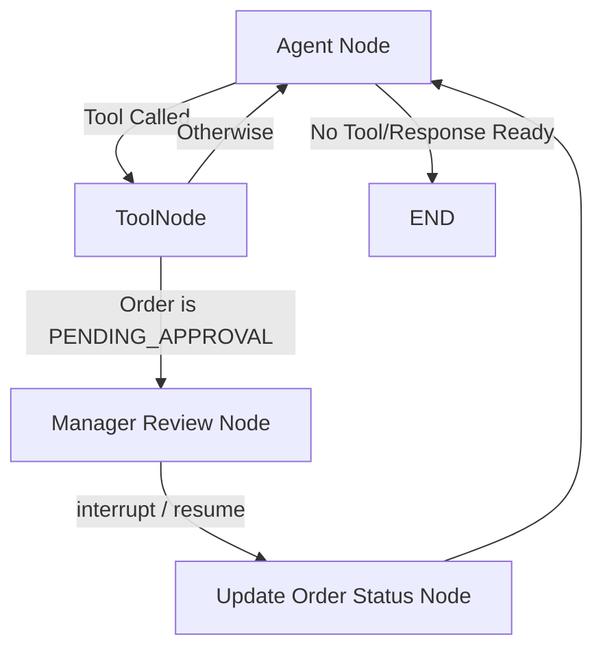

# Restaurant Ordering System with Human-in-the-Loop Approval

This project implements a complete Restaurant Ordering System using a multi-agentic state machine built with **Python**, **LangGraph**, **LangChain**, **Gemini API**, and **SQLite**. It demonstrates human-in-the-loop (HITL) approval mechanics in AI agent workflows, inventory management, and database synchronization.

## Architecture

The system uses a state graph constructed via **LangGraph**:
1. **Agent Node**: Parses user inputs using the Gemini API. The agent can invoke tools to interact with the database.
2. **ToolNode**: Executes the agent's database-backed tools.
3. **Manager Review Node**: Interrupted automatically if the order is transitioned to `PENDING_APPROVAL`. It calls `interrupt()` to request manager input.
4. **Update Order Status Node**: Executes the manager's decision in the database.

### Workflow Routing



---

## Order Lifecycle

An order moves through the following stages:
1. **DRAFT**: Created when the customer specifies items. No inventory is deducted yet.
2. **PENDING_APPROVAL**: Prompted when the customer confirms they wish to submit the order.
3. **APPROVED**: Finalized by the manager. Items are automatically deducted from the inventory.
4. **REJECTED**: Finished by the manager. No inventory is deducted.
5. **DELIVERED**: Optional final delivery stage.

---

## Inventory Management

### Inventory Deduction
When the manager transitions an order's status to `APPROVED`, the database automatically deducts the requested quantities from the `menu` table. If the inventory is insufficient, the status transition fails, preserving consistency.

### Inventory Restoration
If an order is modified *after* it has already been `APPROVED`:
1. The system automatically restores the stock quantities of the original items.
2. The order is modified to the new items.
3. The order status is reset to `PENDING_APPROVAL`, awaiting manager review.
4. If approved again, the new items' quantities are deducted.

---

## Manager Approval

Manager approval is mandatory. The agent has absolute instructions not to approve orders itself. The graph uses LangGraph's native `interrupt()` feature, saving the state checkpointer to SQLite/Memory, waiting for the terminal interface to collect input from the manager (approval/rejection and optional note), and resuming using `Command(resume=...)`.

---

## How to Run

### 1. Install Dependencies
Make sure you have Python 3.11+ installed. Install the dependencies:
```bash
pip install -r requirement.txt
```

### 2. Configure Environment Variables
Create a `.env` file in the root directory (or use the existing one) and configure your Google Gemini API key:
```env
GEMINI_API_KEY=your_gemini_api_key_here
```

### 3. Start the Chatbot
Run the application using:
```bash
python main.py
```

---

## Example Conversation

```text
Database initialized and seeded.

=============================================
      Welcome to the AI Restaurant!          
=============================================

--- MENU ---
- Burger: Rs. 120 (Stock: 20)
- Coke: Rs. 50 (Stock: 40)
- Coffee: Rs. 80 (Stock: 25)
- Fries: Rs. 90 (Stock: 30)
- Pizza: Rs. 250 (Stock: 15)
---------------------------------------------

You can chat with the assistant. Type 'exit' to quit.

Customer: I'd like to order 2 Burgers and a Coke please.

Assistant: I have checked the availability and the items are in stock. I've created a DRAFT order for you (Order ID: 1) with 2 Burger(s) and 1 Coke(s). The total is Rs. 290. 

Please note that manager approval is mandatory to finalize all orders. Would you like me to submit this order for manager approval?

Customer: Yes, please submit it.

=============================================
 SYSTEM INTERRUPT: MANAGER APPROVAL REQUIRED 
=============================================
Order ID: 1
Items:
  - Burger: 2
  - Coke: 1
Current status: PENDING_APPROVAL
=============================================
Manager, approve or reject this order? (a/r/exit): a
Manager note (optional): Looks good!

Assistant: Great news! The manager has APPROVED your order (Order ID: 1) with the note: 'Looks good!'. Your order is now being processed.
```
